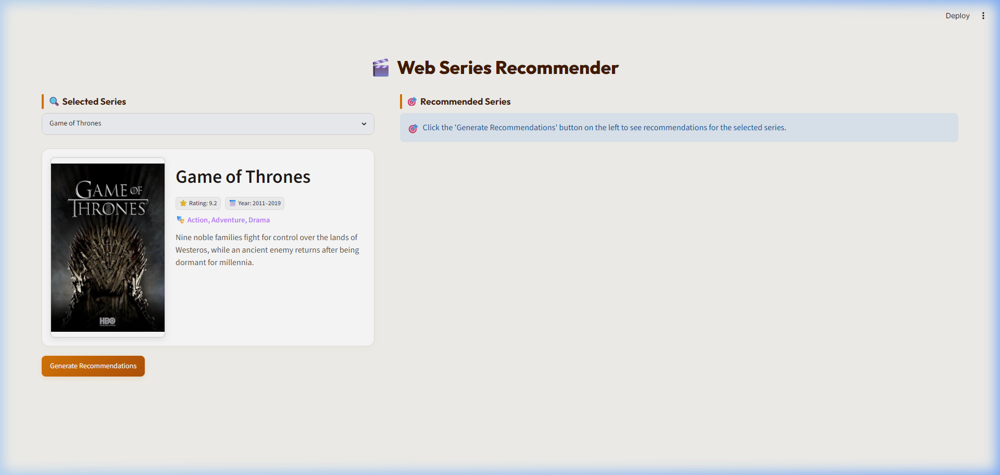
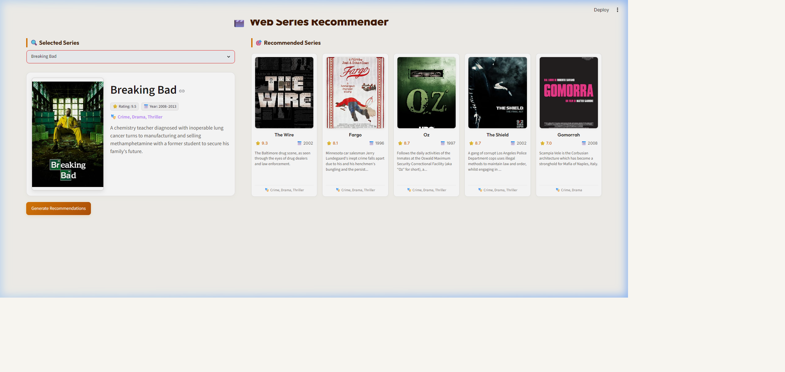

# 🎬 Web Series Recommender

A premium, content-based recommendation engine for TV series and web shows built with **Streamlit**, **Pandas**, and **Scikit-Learn**. The system analyzes genres, descriptions, and ratings to find the most relevant shows matching your search, optimized with caching and parallel API requests.

---

## 📸 Application Screenshots

### 1. Initial State (Idle)
*Displays the selected show details card and prompts the user to generate recommendations.*


### 2. Recommendations Generated
*Loads and renders highly relevant recommendations side-by-side, including ratings, years, genres, and summaries.*


---

## 🌟 Features

* **Advanced Recommendation Algorithm**: Uses **TF-IDF Vectorization** and **Cosine Similarity** on descriptions and genres, blended with normalized IMDb scores for ratings-based soft boosting.
* **Curated IMDb Dataset**: Powered by a cleaned list of 1,926 popular web series and TV shows, ensuring recommendations are highly relevant and recognizable.
* **OMDb API Caching**: Leverages `@st.cache_data` to cache metadata, posters, and summaries fetched from OMDb, providing near-instant load times on repeated interactions.
* **Parallel API Requests**: Fetches details for recommended series simultaneously using a `ThreadPoolExecutor`, reducing peak load times from 15 seconds to under 1 second.
* **Responsive Styling**: Supports elegant grid wrapping and adaptive column layouts, providing a clean dashboard view on desktop (single page without scrollbar), tablet, and mobile screens.
* **Theme Legibility overrides**: Custom inputs and widgets styled explicitly to keep headers and dropdown selectors completely legible in both Streamlit light and dark themes.

---

## 🚀 How to Run Locally

### 1. Prerequisites
Ensure you have **Python 3.10+** installed on your system.

### 2. Clone and Setup
Open your terminal and run:

```bash
# Clone the repository
git clone https://github.com/pooja1845/web-series-recommender.git

# Navigate into the project folder
cd web-series-recommender
```

### 3. Install Dependencies
Install all required libraries using the requirements file:

```bash
pip install -r requirements.txt
```

### 4. Launch the App
Run the Streamlit server:

```bash
streamlit run app.py
```

The application will automatically open in your default web browser at `http://localhost:8501`.

---

## 📂 Project Structure

```
├── assets/
│   ├── initial_state.png           # Screenshot of idle state
│   └── recommendations.png         # Screenshot of recommendations state
├── app.py                         # Main Streamlit web application
├── IMDB_TV_Shows_Clean.csv        # Pre-cleaned curated dataset
├── requirements.txt               # Project dependencies
└── .gitignore                     # Git exclusion rules
```
